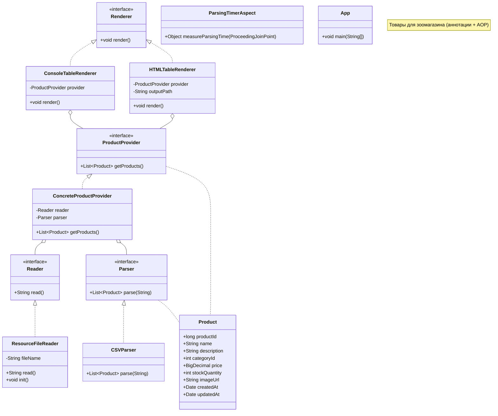

# Лабораторная работа №2. Конфигурирование приложения Spring с помощью аннотаций. Применение AOP для логирования

## Цель работы

Перевести приложение «Магазин товаров для животных» на конфигурирование с помощью аннотаций, добавить вывод таблицы в HTML-файл, использовать события жизненного цикла бина и замерить время парсинга CSV с помощью AOP.

## Ход работы

### 1. Переход на аннотации

Класс `AppConfiguration` с `@Bean`-методами заменён на аннотации `@Component` на каждом классе-реализации и `@ComponentScan` в точке входа `App`. Зависимости внедряются автоматически через конструктор.

### 2. Конфигурация через application.properties и @Value

Файл `application.properties` содержит параметры:

```properties
csv.filename=product.csv
html.output.path=output.html
```

- `ResourceFileReader` получает имя CSV-файла через `@Value("${csv.filename}")`.
- `HTMLTableRenderer` получает путь вывода через `@Value("${html.output.path}")`.
- Конфигурационный файл подключается через `@PropertySource("classpath:application.properties")`.

### 3. HTMLTableRenderer

Добавлена новая реализация `Renderer` — `HTMLTableRenderer`, которая формирует HTML-страницу с таблицей товаров и сохраняет её в файл. Аннотация `@Primary` обеспечивает приоритет этой реализации над `ConsoleTableRenderer`.

### 4. Жизненный цикл бина

В `ResourceFileReader` добавлен метод `init()` с аннотацией `@PostConstruct`, который выводит в консоль дату и время полной инициализации бина.

### 5. AOP — замер времени парсинга

Создан аспект `ParsingTimerAspect` с advice типа `@Around`, который оборачивает вызов `CSVParser.parse()` и выводит затраченное время в миллисекундах. AOP активируется аннотацией `@EnableAspectJAutoProxy`.

### 6. Диаграмма классов



### 7. Запуск

```bash
cd les04/lab
gradle run
```

## Результат

Приложение компилируется и запускается командой `gradle run`. В консоли выводятся:
- дата/время инициализации бина `ResourceFileReader`
- время парсинга CSV (AOP)
- сообщение о сохранении HTML-файла

Таблица товаров сохраняется в файл `output.html`.
