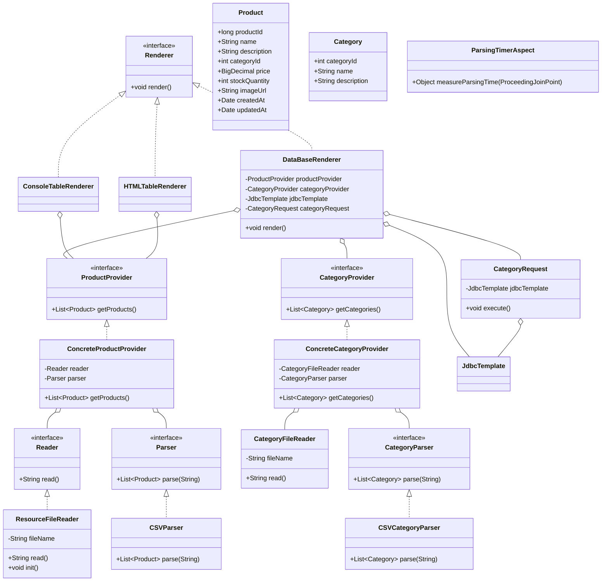

# Лабораторная работа №3. Технологии работы с базами данных. JDBC

## Цель работы

Научить приложение «Магазин товаров для животных» сохранять данные в базе данных H2 с использованием Spring JDBC, JdbcTemplate и RowMapper, а также выполнять SQL-запросы с выводом результатов через логирование.

## Ход работы

### 1. Подключение встраиваемой базы данных H2

В `build.gradle.kts` добавлены зависимости `spring-jdbc`, `h2` и `logback-classic`. В классе `App` настроен `EmbeddedDatabaseBuilder`, который при старте создаёт in-memory базу H2 и выполняет скрипт `schema.sql`.

### 2. SQL-схема базы данных

Файл `schema.sql` создаёт две таблицы с внешним ключом:

- **CATEGORIES** — `category_id` (PK), `name`, `description`
- **PRODUCTS** — `product_id` (PK), `name`, `description`, `category_id` (FK → CATEGORIES), `price`, `stock_quantity`, `image_url`, `created_at`, `updated_at`

### 3. Модель Category и ConcreteCategoryProvider

Создан класс `Category` с полями `categoryId`, `name`, `description`. Класс `ConcreteCategoryProvider` реализует интерфейс `CategoryProvider` и предоставляет список категорий, считанных из `category.csv` через `CategoryFileReader` и `CSVCategoryParser`.

### 4. DataBaseRenderer

Новая реализация `Renderer` с аннотацией `@Primary`. Сохраняет данные из CSV-файлов (категории и товары) в таблицы базы данных через `JdbcTemplate.update()`. После вставки вызывает `CategoryRequest.execute()`.

### 5. CategoryRequest

Выполняет SQL-запрос, получающий категории с количеством товаров > 1. Результаты выводятся через `logback` с уровнем `INFO`.

### 6. Диаграмма классов



### 7. Запуск

```bash
cd les06/lab
gradle run
```

## Результат

Приложение запускается командой `gradle run`, создаёт in-memory базу H2, загружает данные из CSV в таблицы CATEGORIES и PRODUCTS, выполняет SQL-запрос и выводит через logback категорию «Средства ухода» с 2 товарами.
