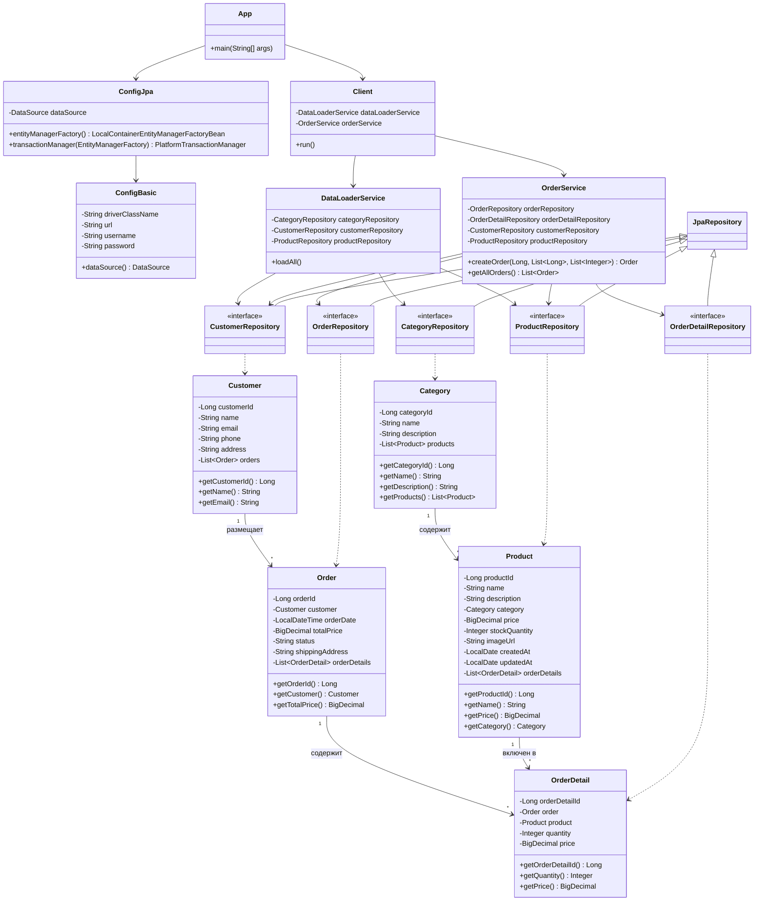
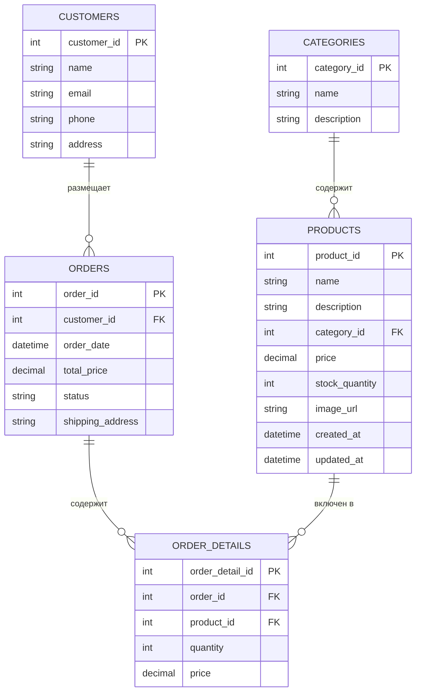

# Лабораторная работа №4. Технологии работы с базами данных. JPA. Spring Data

## Цель работы

Выполнить рефакторинг приложения магазина зоотоваров: перейти с использования Spring JDBC на ORM Hibernate и Spring Data JPA. Расширить приложение новыми сущностями и привести структуру в соответствие со слоистой архитектурой.

## Выполненные задачи

1. Создано приложение с использованием **Spring Context**, **Hibernate ORM** и **Spring Data JPA**.
2. Настроен **DataSource** с использованием **H2** (in-memory) и **HikariCP**.
3. Схема данных создаётся автоматически на основании JPA-сущностей (`hbm2ddl.auto = create`).
4. Реализованы 5 JPA-сущностей: `Category`, `Product`, `Customer`, `Order`, `OrderDetail`.
5. Реализованы Spring Data JPA репозитории для каждой сущности.
6. Реализованы сервисы: `DataLoaderService` (загрузка CSV) и `OrderService` (создание и получение заказов).
7. Реализован клиент `Client`, который загружает данные из CSV, создаёт заказ в транзакции и выводит доказательство сохранения.
8. Приложение запускается через `gradle run`.

## Структура пакетов

```
ru.bsuedu.cad.lab             — основной пакет (App, Config)
ru.bsuedu.cad.lab.entity      — JPA сущности
ru.bsuedu.cad.lab.repository   — Spring Data JPA репозитории
ru.bsuedu.cad.lab.service      — бизнес-логика (сервисы)
ru.bsuedu.cad.lab.app          — клиентское приложение
```

## Технологии

- Java 17
- Spring Context 6.2.2
- Spring ORM 6.2.2
- Spring Data JPA 3.4.4
- Hibernate 6.2.0.Final
- HikariCP 5.0.1
- H2 Database 2.2.224
- Logback 1.5.6
- Gradle (Kotlin DSL)

## Запуск

```bash
cd les08/lab
gradle run
```

## UML-диаграмма классов



## Схема базы данных (ER-диаграмма)


