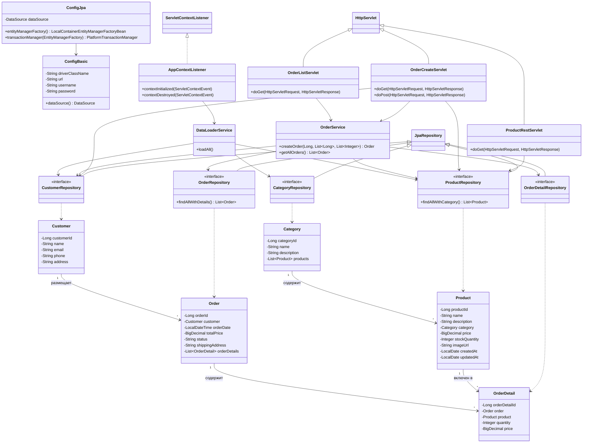

# Лабораторная работа №5. Разработка и развертывание Web-приложений

## Цель работы

Добавить веб-интерфейс к приложению магазина зоотоваров с использованием Java-сервлетов. Реализовать страницу списка заказов, форму создания заказа и REST-сервис для получения информации о продуктах. Развернуть приложение на Apache Tomcat 11.

## Выполненные задачи

1. Скопирован и адаптирован проект из лабораторной работы №4.
2. Проект переведён на сборку WAR-файла (плагин `war` в Gradle).
3. Настроен Spring `ContextLoaderListener` через `web.xml` для инициализации Spring-контекста в Tomcat.
4. Реализован `AppContextListener` (`@WebListener`) — загрузка данных из CSV при старте приложения.
5. Реализован `OrderListServlet` (`/orders`) — страница со списком всех заказов и кнопкой создания нового.
6. Реализован `OrderCreateServlet` (`/orders/create`) — форма создания заказа (GET — форма, POST — обработка). После создания — редирект на список заказов.
7. Реализован `ProductRestServlet` (`/api/products`) — REST-сервис, возвращающий JSON с информацией о продуктах (название, категория, остаток на складе).
8. Приложение собирается командой `gradle war`.

## Структура пакетов

```
ru.bsuedu.cad.lab               — конфигурация (ConfigBasic, ConfigJpa)
ru.bsuedu.cad.lab.entity        — JPA сущности
ru.bsuedu.cad.lab.repository    — Spring Data JPA репозитории
ru.bsuedu.cad.lab.service       — бизнес-логика
ru.bsuedu.cad.lab.servlet       — сервлеты (Web UI + REST API)
```

## Технологии

- Java 17
- Spring Context / ORM / Web / Data JPA
- Hibernate 6.2.0.Final + HikariCP
- H2 Database (in-memory)
- Jakarta Servlet 6.0
- Jackson (JSON-сериализация)
- Apache Tomcat 11
- Gradle (WAR)

## Сборка и деплой

```bash
cd les10/lab
gradle war
```

WAR-файл: `app/build/libs/app.war`

Деплой на Tomcat:
1. Скопировать `app.war` в `$CATALINA_HOME/webapps/`
2. Или загрузить через Tomcat Manager (`http://localhost:8080/manager/html`)

## Эндпоинты

| URL | Метод | Описание |
|-----|-------|----------|
| `/app/orders` | GET | Страница со списком заказов |
| `/app/orders/create` | GET | Форма создания заказа |
| `/app/orders/create` | POST | Обработка формы создания заказа |
| `/app/api/products` | GET | REST API — список продуктов (JSON) |

## Пример REST-ответа `/api/products`

```json
[
  {
    "productId": 1,
    "name": "Сухой корм для собак",
    "categoryName": "Корма",
    "stockQuantity": 50
  },
  {
    "productId": 2,
    "name": "Игрушка для кошек Мышка",
    "categoryName": "Игрушки",
    "stockQuantity": 200
  }
]
```

## UML-диаграмма классов


