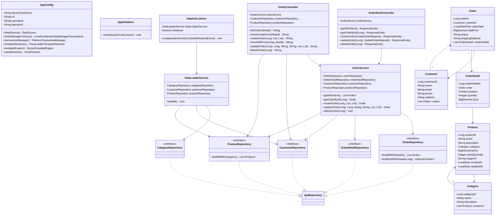

# Лабораторная работа 6. Разработка Web-приложений с использованием технологии Spring MVC

## Цель работы

Разработка веб-приложения магазина зоотоваров с использованием Spring MVC, REST API и шаблонизатора Thymeleaf.

## Выполненные задания

1. Скопирован результат лабораторной работы №5 в директорию `les12/lab/`
2. Проект настроен для работы со Spring MVC (`DispatcherServlet`, `@EnableWebMvc`, `WebApplicationInitializer`)
3. Реализован REST API для работы с заказами (`OrderRestController`):
   - `GET /api/orders` — получение списка заказов
   - `GET /api/orders/{id}` — получение заказа по идентификатору
   - `POST /api/orders` — создание заказа
   - `PUT /api/orders/{id}` — изменение заказа
   - `DELETE /api/orders/{id}` — удаление заказа
4. Приложение задеплоено на Apache Tomcat 11, REST API протестирован через Postman
5. Подключён шаблонизатор Thymeleaf. Реализован веб-интерфейс для работы с заказами:
   - Просмотр списка заказов (`/orders`)
   - Создание нового заказа (`/orders/new`)
   - Редактирование заказа (`/orders/{id}/edit`)
   - Удаление заказа (`/orders/{id}/delete`)
6. Приложение собрано командой `gradle war`
7. Выполнен деплой WAR-файла на Apache Tomcat 11

## Структура проекта

```
les12/lab/
├── settings.gradle.kts
├── gradle/
│   └── libs.versions.toml
└── app/
    ├── build.gradle.kts
    └── src/main/
        ├── java/ru/bsuedu/cad/lab/
        │   ├── AppConfig.java              — конфигурация Spring (JPA, Thymeleaf, WebMvc)
        │   ├── AppInitializer.java          — регистрация DispatcherServlet
        │   ├── DataInitListener.java        — загрузка данных из CSV при старте
        │   ├── controller/
        │   │   ├── OrderRestController.java — REST API (CRUD заказов)
        │   │   └── OrderController.java     — MVC контроллер (Thymeleaf UI)
        │   ├── entity/
        │   │   ├── Category.java
        │   │   ├── Customer.java
        │   │   ├── Product.java
        │   │   ├── Order.java
        │   │   └── OrderDetail.java
        │   ├── repository/
        │   │   ├── CategoryRepository.java
        │   │   ├── CustomerRepository.java
        │   │   ├── ProductRepository.java
        │   │   ├── OrderRepository.java
        │   │   └── OrderDetailRepository.java
        │   └── service/
        │       ├── DataLoaderService.java
        │       └── OrderService.java
        └── resources/
            ├── csv/                         — исходные данные
            ├── db/jdbc.properties           — настройки H2
            ├── logback.xml
            └── templates/
                ├── order-list.html          — список заказов
                ├── order-create.html        — форма создания
                └── order-edit.html          — форма редактирования
```

## Технологии

- Java 17
- Spring MVC 6.2.2
- Spring Data JPA 3.4.4
- Hibernate 6.2.0
- Thymeleaf 3.1.2
- H2 Database (in-memory)
- HikariCP
- Jackson (JSON)
- Gradle (WAR)
- Apache Tomcat 11

## Сборка и запуск

```bash
./gradlew war
cp app/build/libs/pet-store.war <TOMCAT_HOME>/webapps/
```

После деплоя:
- Веб-интерфейс: `http://localhost:8080/pet-store/orders`
- REST API: `http://localhost:8080/pet-store/api/orders`

## Примеры REST-запросов

**Создание заказа:**
```
POST /pet-store/api/orders
Content-Type: application/json

{"customerId": 1, "productIds": [1, 2], "quantities": [2, 3]}
```

**Обновление заказа:**
```
PUT /pet-store/api/orders/1
Content-Type: application/json

{"customerId": 2, "status": "PROCESSING", "shippingAddress": "Новый адрес", "productIds": [3], "quantities": [1]}
```

**Удаление заказа:**
```
DELETE /pet-store/api/orders/1
```

## UML-диаграмма классов


