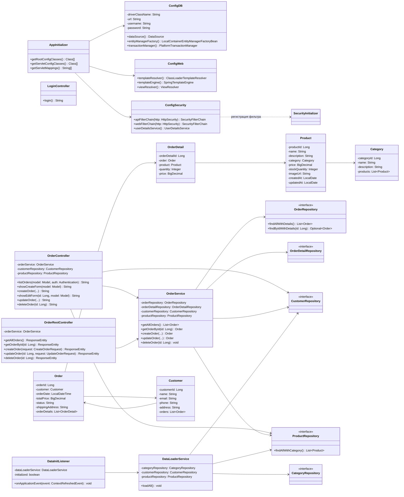

# Лабораторная работа 7. Spring Security. Basic Authentication

## Описание

В рамках лабораторной работы в приложение «Магазин зоотоваров» был добавлен ролевой доступ с использованием Spring Security.

## Что было сделано

1. **Скопирован проект из лабораторной работы №6** (`les12/lab`) в директорию `les14/lab`.
2. **Добавлены зависимости Spring Security** (`spring-security-web`, `spring-security-config`) в `build.gradle.kts` и `libs.versions.toml`.
3. **Конфигурация разделена** на три класса по образцу демо-проекта:
   - `ConfigDB` — DataSource, JPA, транзакции
   - `ConfigWeb` — Thymeleaf, Spring MVC
   - `ConfigSecurity` — настройки безопасности
4. **Добавлены два пользователя** (in-memory):
   - `user` / `1234` — роль `USER` (только просмотр заказов)
   - `manager` / `1234` — роль `MANAGER` (все операции с заказами: создание, редактирование, удаление)
5. **Реализована аутентификация через форму** (Form Login) для веб-интерфейса (`/orders/**`):
   - Создана кастомная страница входа (`login.html`)
   - Добавлен `LoginController`
   - При успешном входе — редирект на `/orders`
6. **Реализована Basic Authentication** для REST API (`/api/**`):
   - Отдельный `SecurityFilterChain` с `@Order(1)` и `securityMatcher("/api/**")`
   - CSRF отключен для API
7. **Разграничение прав в веб-интерфейсе**:
   - Пользователь `user` видит только список заказов (кнопки создания/редактирования/удаления скрыты)
   - Пользователь `manager` имеет полный доступ ко всем операциям
   - Серверная авторизация через `requestMatchers` + `hasRole`
8. **AppInitializer** переведён на `AbstractAnnotationConfigDispatcherServletInitializer` (как в демо)
9. **Добавлен `SecurityInitializer`** — наследник `AbstractSecurityWebApplicationInitializer` для регистрации фильтра Spring Security.

## Сборка и деплой

```bash
# Сборка WAR
./gradlew war

# WAR-файл будет в app/build/libs/pet-store.war
# Скопировать в $CATALINA_HOME/webapps/ и запустить Tomcat 11
```

## Тестирование

### Веб-интерфейс (Form Login)

- Открыть `http://localhost:8080/pet-store/orders` → редирект на страницу входа
- Войти как `user` / `1234` → список заказов без кнопок управления
- Войти как `manager` / `1234` → полный доступ (создание, редактирование, удаление)

### REST API (Basic Authentication)

```bash
# Получить все заказы (user)
curl -u user:1234 http://localhost:8080/pet-store/api/orders

# Создать заказ (manager)
curl -u manager:1234 -X POST http://localhost:8080/pet-store/api/orders \
  -H "Content-Type: application/json" \
  -d '{"customerId":1,"productIds":[1,2],"quantities":[2,3]}'

# Без авторизации → 401 Unauthorized
curl http://localhost:8080/pet-store/api/orders
```

## Учётные записи

| Логин   | Пароль | Роль    | Веб-интерфейс                 | REST API         |
|---------|--------|---------|-------------------------------|------------------|
| user    | 1234   | USER    | Только просмотр заказов       | GET-запросы      |
| manager | 1234   | MANAGER | Все операции с заказами       | Все методы       |

## UML-диаграмма классов


