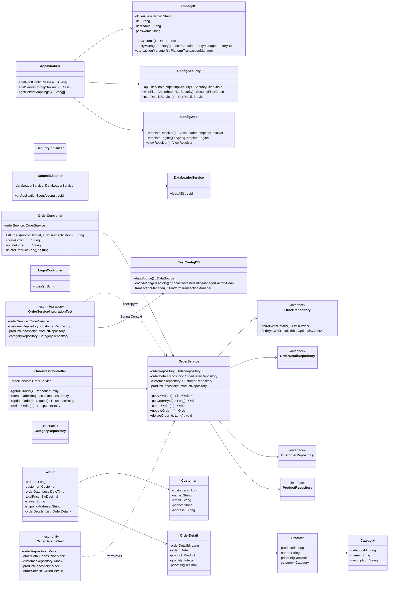

# Лабораторная работа 8. Основы тестирования

## Описание

В рамках лабораторной работы для приложения «Магазин зоотоваров» были написаны Unit-тесты и интеграционные тесты сервиса создания заказов, а также настроен JaCoCo для генерации отчётов о покрытии кода.

## Что было сделано

1. **Скопирован проект** из лабораторной работы №7 (les14/lab) в директорию `les16/lab`.
2. **Настроен проект для Unit-тестирования**: добавлены зависимости JUnit 5, Mockito, AssertJ.
3. **Настроен JaCoCo**: плагин `jacoco` в `build.gradle.kts`, отчёт формируется автоматически после запуска тестов в `app/build/jacocoHtml/`.
4. **Написаны Unit-тесты** для `OrderService` (`OrderServiceTest.java`):
   - Успешное создание заказа с одним товаром
   - Успешное создание заказа с несколькими товарами
   - Ошибка: клиент не найден
   - Ошибка: товар не найден
   - Успешное получение заказа по ID
   - Ошибка: заказ не найден
   - Получение списка заказов
   - Пустой список заказов
   - Успешное удаление заказа
   - Ошибка: удаление несуществующего заказа
5. **Настроен проект для интеграционного тестирования**: добавлена зависимость `spring-test`, создана тестовая конфигурация `TestConfigDB` с H2 in-memory.
6. **Написаны интеграционные тесты** (`OrderServiceIntegrationTest.java`):
   - Создание заказа сохраняется в БД с правильной суммой
   - Создание заказа с одним товаром
   - getAllOrders возвращает созданные заказы
   - deleteOrder удаляет заказ из БД
   - updateOrder обновляет данные в БД
   - Ошибка: несуществующий клиент
   - Ошибка: несуществующий товар
   - Ошибка: несуществующий заказ (get/delete/update)

## Запуск тестов и формирование отчёта

```bash
cd les16/lab
./gradlew test

# Отчёт JaCoCo будет в:
# app/build/jacocoHtml/index.html
```

## Структура тестов

| Файл | Тип | Кол-во тестов | Описание |
|------|-----|---------------|----------|
| `OrderServiceTest.java` | Unit | 10 | Тесты с моками (Mockito), изоляция от БД |
| `OrderServiceIntegrationTest.java` | Интеграционный | 9 | Spring Context + H2, реальное взаимодействие с репозиториями |

## Используемые технологии тестирования

| Библиотека | Назначение |
|-----------|-----------|
| JUnit 5 | Фреймворк тестирования |
| Mockito | Создание моков и заглушек для Unit-тестов |
| AssertJ | Fluent-проверки (assertThat) |
| Spring Test | Загрузка Spring контекста для интеграционных тестов |
| H2 Database | In-memory БД для интеграционных тестов |
| JaCoCo | Отчёт о покрытии кода тестами |

## UML-диаграмма классов


